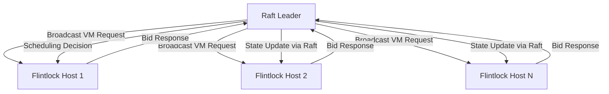
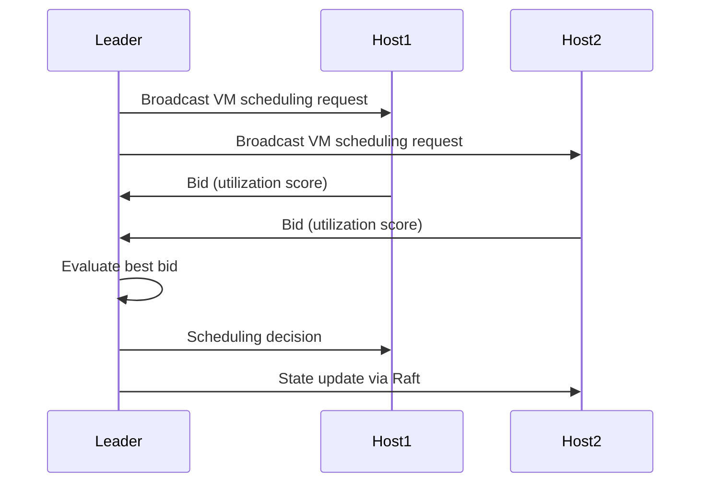

## Distributed Scheduling and Bidding Mechanism

### Gap Definition and Improvement Objectives

Flintlock currently lacks a distributed scheduling system, relying instead on manual workload allocation per host. Implementing a distributed scheduling mechanism using a bidding process will ensure balanced resource utilization and improved VM provisioning speed.

**Objectives:**

* Balanced resource allocation across all hosts
* Reduced VM boot latency
* Automated and transparent workload distribution

### Technical Implementation and Detailed Architecture

* **Resource Broadcasting:** Hosts periodically broadcast current resource metrics (CPU, memory, VM count).
* **Leader Coordination:** Leader initiates VM scheduling by broadcasting requests to hosts.
* **Bid Calculation:** Hosts compute utilization scores based on available resources and VM requirements, responding with bids.
* **Scheduling Decision:** Leader selects the host with the lowest utilization score (best bid), updating the global state through consensus.

### Trade-offs and Risks

* **Complexity:** Additional complexity due to broadcast and bidding logic.
* **Latency:** Slight communication overhead for bid requests and responses.

### Operational Impacts and User Considerations

* **Transparency:** Users experience automated and balanced VM scheduling without manual intervention.
* **Operational Simplicity:** Reduced administrative overhead and improved cluster scalability.

### Validation and Testing Strategies

* **Bid Accuracy Tests:** Ensure host bids accurately reflect resource availability.
* **Scheduling Fairness Tests:** Verify balanced workload distribution across hosts.
* **Performance Benchmarks:** Assess scheduling latency and efficiency under various loads.

### Visualizations and Diagrams

* **High-Level Design (HLD) Diagram:**

* **Sequence Diagram:**

### Summary for Enhancement Proposal

Introducing a distributed scheduling and bidding mechanism significantly enhances Flintlock's ability to evenly distribute workloads and minimize VM provisioning times. This approach improves cluster resource utilization efficiency and operational transparency, setting the foundation for robust scalability and responsiveness.
