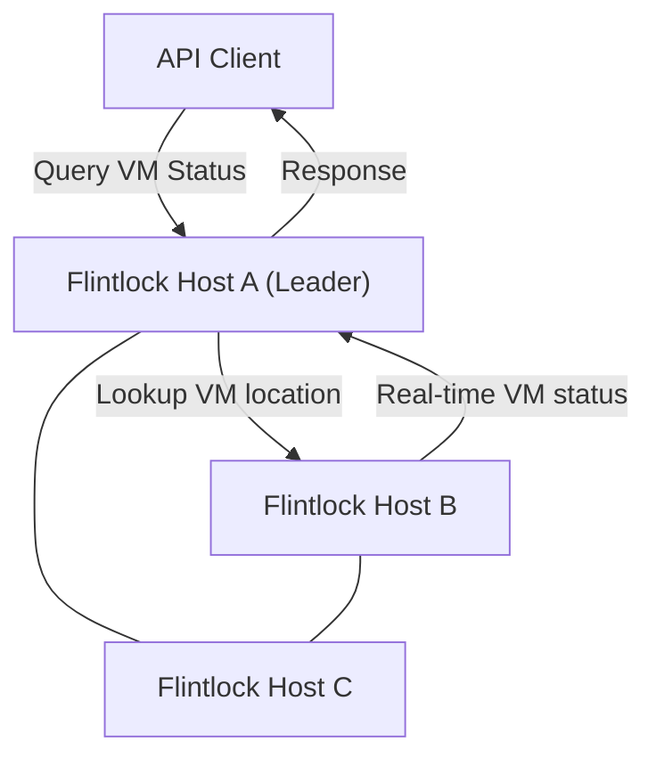
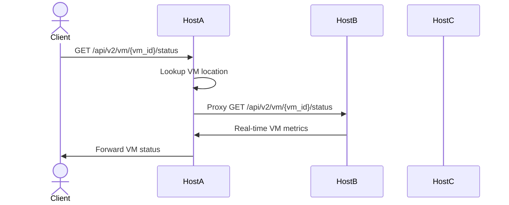

## Unified API Interface and Proxy Routing

### Gap Definition and Improvement Objectives

Currently, Flintlock APIs are isolated per host, causing inconsistent and fragmented state queries. Introducing a unified API interface with proxy routing will resolve these inconsistencies and enable accurate VM state reporting from the authoritative host.

**Objectives:**

* Preserve compatibility with existing Flintlock APIs
* Provide enhanced global state querying through new `/api/v2` endpoints
* Implement proxy routing for authoritative, real-time VM status

### Technical Implementation and Detailed Architecture

* **API Versioning:** Retain current `/api/v1` APIs for backward compatibility, adding new `/api/v2` endpoints.
* **Global State Registry:** Maintain minimal global VM metadata (host location, VM ID).
* **Proxy Routing:** Route detailed state queries to the actual host running the VM, providing accurate real-time metrics.

### Trade-offs and Risks

* **Latency:** Slight latency increase from proxy routing requests to authoritative hosts.
* **Complexity:** Increased API routing logic to handle proxy queries.

### Operational Impacts and User Considerations

* **Transparency:** Users experience transparent and accurate VM state querying without changing existing workflows.
* **Improved Observability:** Enhanced visibility into VM states and metrics.

### Validation and Testing Strategies

* **API Compatibility Tests:** Ensure backward compatibility with existing endpoints.
* **Proxy Routing Accuracy Tests:** Verify accuracy and responsiveness of proxy-routed queries.
* **Real-time Metrics Validation:** Continuous validation of real-time metrics accuracy.

### Visualizations and Diagrams

* **High-Level Design (HLD) Diagram:**

* **Sequence Diagram:**

### Summary for Enhancement Proposal

Implementing a unified API interface with proxy routing significantly improves the consistency and accuracy of VM state queries in Flintlock. This enhancement provides transparent compatibility, real-time metrics accuracy, and enhanced operational visibility, preparing Flintlock for effective distributed operations.
