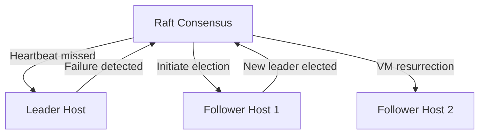
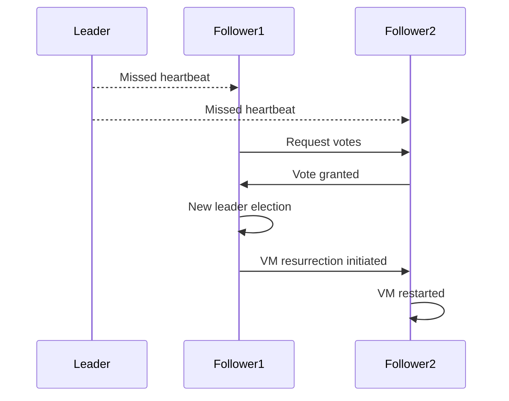

## Host Failure Handling (Leader and Follower Failures)

### Gap Definition and Improvement Objectives

Flintlock currently lacks robust procedures for handling leader and follower host failures, resulting in potential downtime and inconsistencies in VM state. Explicit failure detection and automated VM resurrection mechanisms will address this.

**Objectives:**

* Immediate detection and response to host failures
* Efficient VM resurrection and redistribution across surviving hosts
* Minimise downtime and ensure consistent VM states

### Technical Implementation and Detailed Architecture

* **Failure Detection:** Implement heartbeat mechanisms using Raft consensus to detect leader and follower failures promptly.
* **Leader Election:** Ensure rapid re-election of leaders upon failure.
* **VM Resurrection Workflow:** Automate VM resurrection based on persistent state snapshots stored centrally.
* **State Synchronisation:** Update global state via Raft consensus post-resurrection.

### Trade-offs and Risks

* **Resource Contention:** Potential temporary resource contention during VM resurrection.
* **Complexity:** Increased complexity of failure detection and automated recovery mechanisms.

### Operational Impacts and User Considerations

* **Service Continuity:** Significantly reduced downtime for users.
* **Operational Simplicity:** Reduced manual intervention and simplified host management during failures.

### Validation and Testing Strategies

* **Failure Simulation Tests:** Systematic simulations of leader and follower failures.
* **Resurrection Verification:** Validate VM resurrection processes and state consistency.
* **Recovery Performance:** Measure performance and responsiveness during failover events.

### Visualisations and Diagrams

* **High-Level Design (HLD) Diagram:**

* **Sequence Diagram (Leader Failure):**

### Summary for Enhancement Proposal

Implementing robust host failure handling and automated VM resurrection significantly improves Flintlock's resilience. This ensures continuous service delivery, reduces operational complexity, and enhances the overall reliability and consistency of the cluster's VM management processes.
