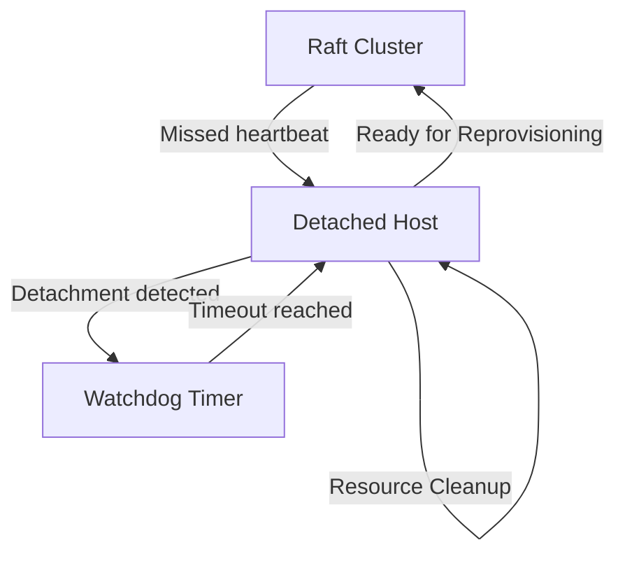
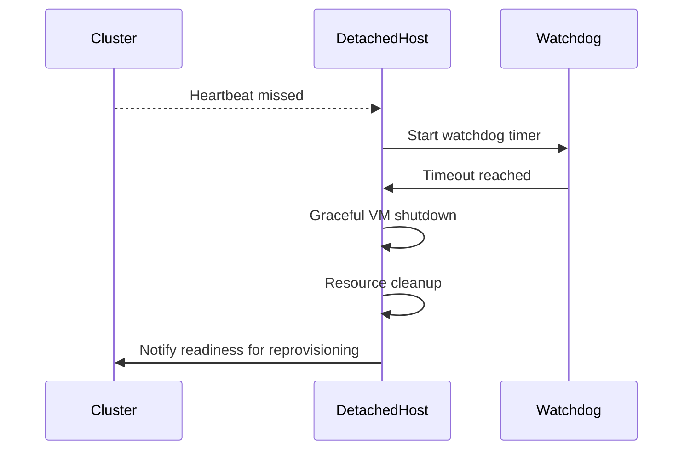

## Detached Host Garbage Collection

### Gap Definition and Improvement Objectives

Flintlock currently lacks automated procedures for managing hosts that become detached from the cluster, leading to potential resource leaks and inconsistent VM states. Implementing robust garbage collection (GC) mechanisms will ensure proper cleanup and prepare hosts for safe reintegration.

**Objectives:**

* Automated and safe VM termination on detached hosts
* Prevention of resource leaks and state inconsistencies
* Preparation of detached hosts for secure and efficient cluster rejoining

### Technical Implementation and Detailed Architecture

* **Detachment Detection:** Monitor host connectivity via Raft heartbeats and identify detached hosts.
* **Watchdog Timer:** Implement configurable watchdog timers to trigger safe VM shutdown.
* **Automated Cleanup:** Automated cleanup of VM resources and host state post-detachment.
* **Preparation for Rejoin:** Ensure the host is cleanly reset, ready for reprovisioning and rejoining the cluster.

### Trade-offs and Risks

* **Risk of Premature Termination:** Potential risk of premature VM termination with overly aggressive GC timeouts.
* **Resource Cleanup Complexity:** Ensuring complete and reliable resource cleanup can add complexity.

### Operational Impacts and User Considerations

* **Operational Efficiency:** Reduces manual intervention by automating resource cleanup.
* **Cluster Integrity:** Ensures cluster resources and state remain consistent, improving overall system reliability.

### Validation and Testing Strategies

* **Detachment Simulation Tests:** Simulate host detachment and validate automated cleanup.
* **Resource Cleanup Verification:** Ensure thorough cleanup of VM and host resources.
* **Watchdog Timing Tests:** Validate configurable timeout functionality and reliability.

### Visualisations and Diagrams

* **High-Level Design (HLD) Diagram:**

* **Sequence Diagram:**

### Summary for Enhancement Proposal

Implementing automated garbage collection for detached hosts ensures resource integrity, state consistency, and operational efficiency within the Flintlock cluster. This robust approach prepares hosts for secure and seamless reintegration, significantly enhancing overall system resilience and operational simplicity.
