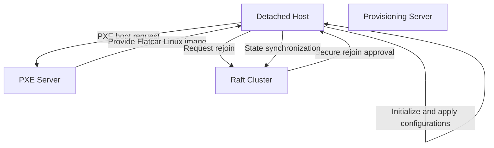
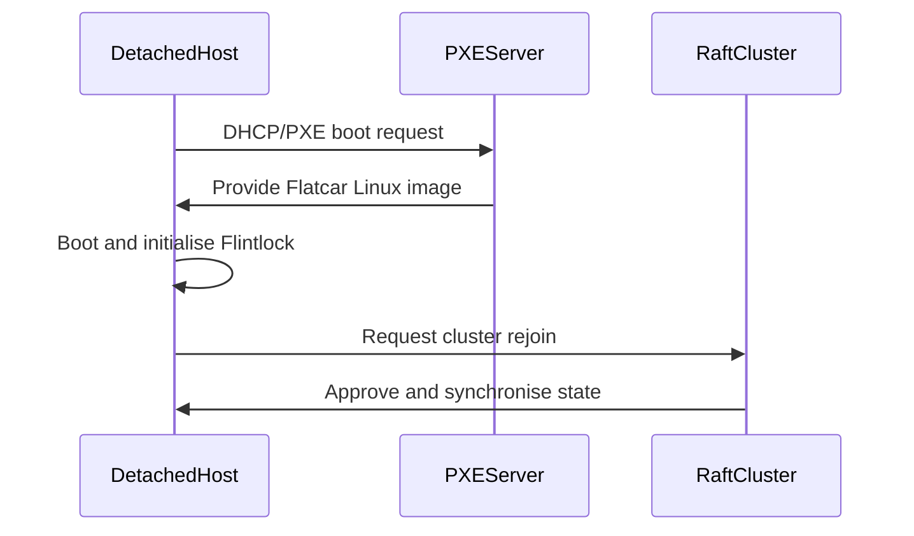

## Host Regeneration and PXE-Based Provisioning

### Gap Definition and Improvement Objectives

Currently, Flintlock lacks automated and streamlined procedures for securely reprovisioning and reintegrating detached hosts back into the cluster. Introducing PXE-based provisioning will enable automated host regeneration and reduce manual operational tasks.

**Objectives:**

* Automated host regeneration via PXE boot
* Seamless host reprovisioning and cluster reintegration
* Minimised operational downtime and manual intervention

### Technical Implementation and Detailed Architecture

* **PXE Boot Infrastructure:** Establish centralised PXE servers providing standardised OS images and Flintlock binaries.
* **Immutable Flatcar Linux Image:** Use Flatcar Linux image that includes the complete latest installation for a Flintlock host, ensuring no drift in host setups.
* **Host Boot and Provisioning:** Automate host boot sequences to fetch OS and Flintlock daemon configurations from PXE servers.
* **Secure Rejoin Protocols:** Define explicit security protocols for hosts rejoining the Raft cluster post-provisioning.
* **State Synchronisation:** Implement state synchronisation via Raft log replay upon host reintegration.

### Trade-offs and Risks

* **Infrastructure Complexity:** Additional setup and management overhead for PXE provisioning infrastructure.
* **Provisioning Reliability:** Risk of provisioning failures impacting host recovery speed.

### Operational Impacts and User Considerations

* **Reduced Operational Overhead:** Significantly less manual intervention required during host recovery.
* **Improved Availability:** Rapid host recovery reduces downtime and enhances cluster availability.

### Validation and Testing Strategies

* **Provisioning Automation Tests:** Verify successful automation of PXE boot and provisioning processes.
* **Security Verification Tests:** Validate secure rejoin procedures and state synchronisation correctness.
* **Performance Benchmarks:** Measure provisioning time and efficiency of host reintegration.

### Visualisations and Diagrams

* **High-Level Design (HLD) Diagram:**

* **Sequence Diagram:**

### Summary for Enhancement Proposal

Automating host regeneration through PXE-based provisioning significantly enhances Flintlock's resilience, reduces operational burden, and accelerates host recovery. Using an immutable Flatcar Linux image ensures consistency across hosts, prevents configuration drift, and provides a secure and efficient reintegration into the cluster, significantly improving overall system reliability and availability.
