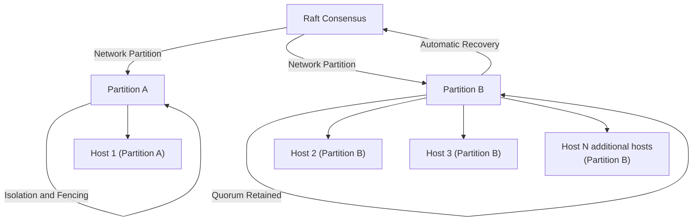
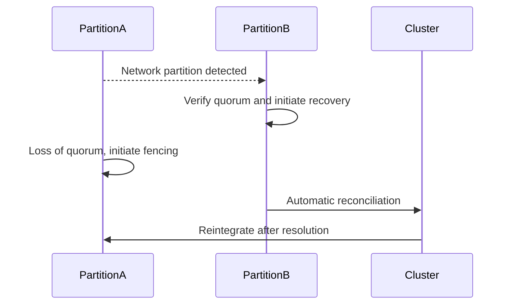

## Network Partition Handling & Split-Brain Scenarios

### Gap Definition and Improvement Objectives

Flintlock currently lacks robust mechanisms to effectively manage network partitions and prevent split-brain conditions. Implementing explicit partition handling and split-brain prevention strategies will improve cluster stability and consistency.

**Objectives:**

* Effective detection and handling of network partitions
* Robust quorum enforcement to prevent split-brain
* Automated and safe resolution of partitioned states

### Technical Implementation and Detailed Architecture

* **Heartbeat Mechanism:** Enhance heartbeat signaling within Raft to promptly detect partitions.
* **Quorum Policies:** Establish explicit quorum rules ensuring decision-making integrity during partitions.
* **Fencing Mechanisms:** Implement host isolation (fencing) to prevent resource contention and split-brain scenarios.
* **Automated Recovery:** Define clear protocols for automated reconciliation and recovery post-partition.

### Trade-offs and Risks

* **False Positives:** Risk of unnecessary failovers or isolation due to aggressive partition detection thresholds.
* **Recovery Complexity:** Complexity in automating safe and consistent partition recovery.

### Operational Impacts and User Considerations

* **Enhanced Reliability:** Increased resilience against disruptions from network partitions.
* **Reduced Manual Intervention:** Automation reduces operational complexity and required manual oversight.

### Validation and Testing Strategies

* **Partition Detection Tests:** Systematically test partition detection mechanisms for accuracy.
* **Quorum Enforcement Tests:** Validate quorum policies and their effectiveness in split-brain prevention.
* **Automated Recovery Tests:** Ensure recovery protocols reliably reconcile partitioned states.

### Visualizations and Diagrams

* **High-Level Design (HLD) Diagram:**

* **Sequence Diagram:**

### Summary for Enhancement Proposal

Introducing robust network partition handling and explicit split-brain prevention significantly enhances Flintlock's stability and consistency. This structured approach ensures reliable quorum enforcement, automated partition recovery, and comprehensive protection against split-brain conditions, thereby greatly improving overall cluster reliability and operational integrity.
