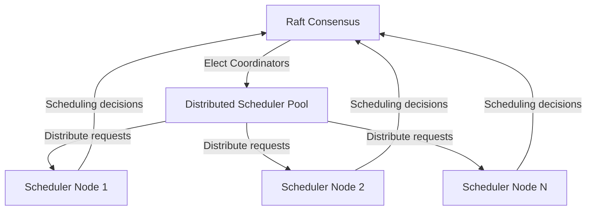
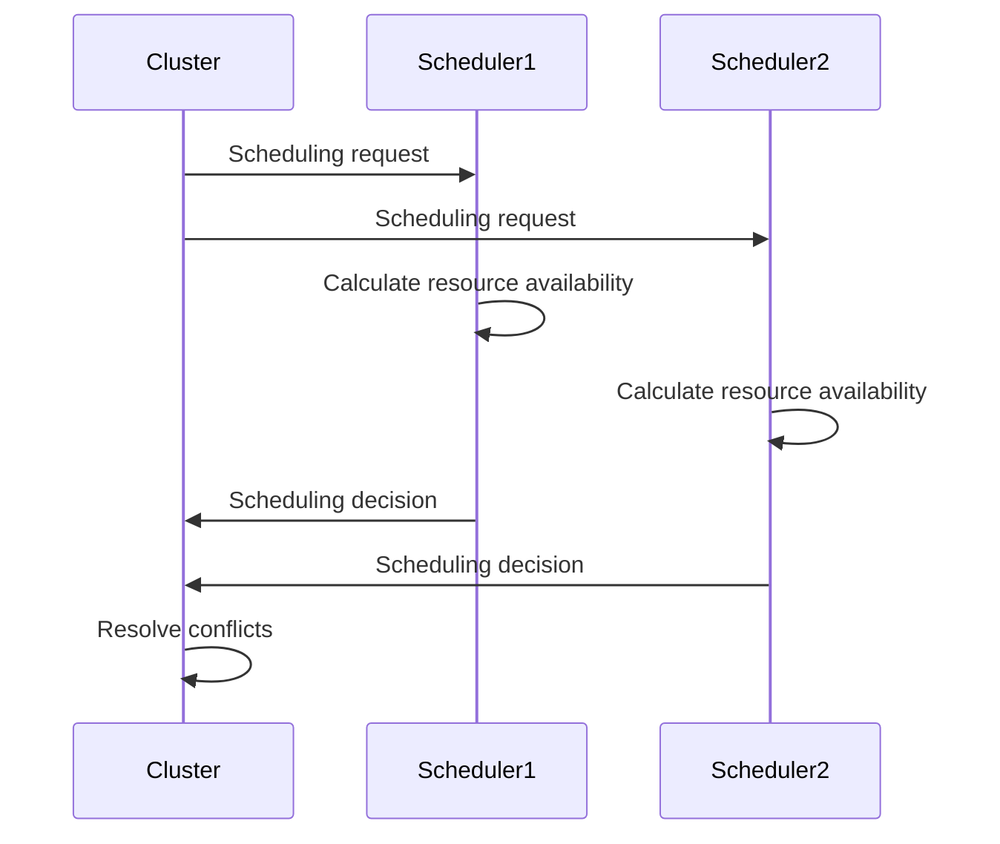

## Leader Scheduling Bottleneck

### Gap Definition and Improvement Objectives

Currently, Flintlock relies on a single Raft leader for all VM scheduling decisions, creating potential bottlenecks under heavy load. Introducing decentralised or multi-leader scheduling approaches can improve scalability and reduce contention.

**Objectives:**

* Mitigate scheduling bottlenecks by decentralising decision-making
* Improve cluster scalability and responsiveness
* Ensure balanced workload distribution and redundancy

### Technical Implementation and Detailed Architecture

* **Distributed Scheduler Pool:** Implement a distributed scheduler mechanism allowing multiple nodes to participate in scheduling.
* **Coordinator Election:** Use Raft to elect a small set of scheduling coordinators rather than a single node.
* **Scheduling Cache:** Maintain a distributed cache of resource states to enable decentralised decision-making.
* **Conflict Resolution:** Clearly define conflict resolution protocols in cases where concurrent scheduling decisions arise.

### Trade-offs and Risks

* **Complexity:** Increased complexity in distributed scheduling logic and conflict management.
* **Coordination Overhead:** Potential overhead in maintaining synchronisation between multiple schedulers.

### Operational Impacts and User Considerations

* **Enhanced Scalability:** Significant improvement in handling high volumes of scheduling requests.
* **Reduced Latency:** Lower scheduling latency and improved responsiveness under heavy workloads.

### Validation and Testing Strategies

* **Scalability Tests:** Benchmark system performance under varying loads and numbers of scheduling coordinators.
* **Conflict Resolution Tests:** Verify effective resolution of scheduling conflicts.
* **Load Distribution Tests:** Confirm balanced workload distribution and redundancy.

### Visualisations and Diagrams

* **High-Level Design (HLD) Diagram:**

* **Sequence Diagram:**

### Summary for Enhancement Proposal

Addressing the leader scheduling bottleneck by implementing decentralised or multi-leader scheduling significantly enhances Flintlock’s scalability and responsiveness. This approach reduces latency, improves workload distribution, and ensures system resilience under heavy workloads, thereby enhancing overall operational effectiveness.
