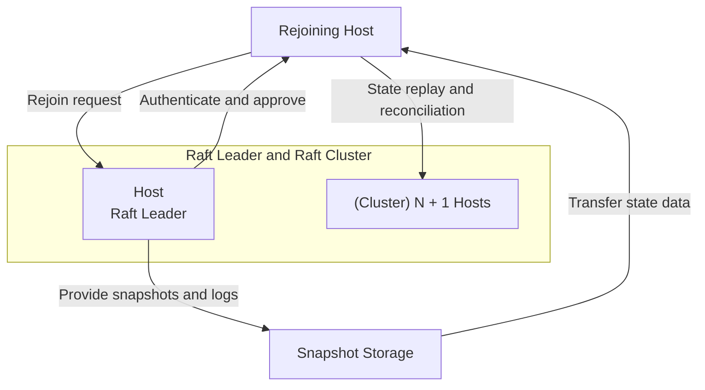
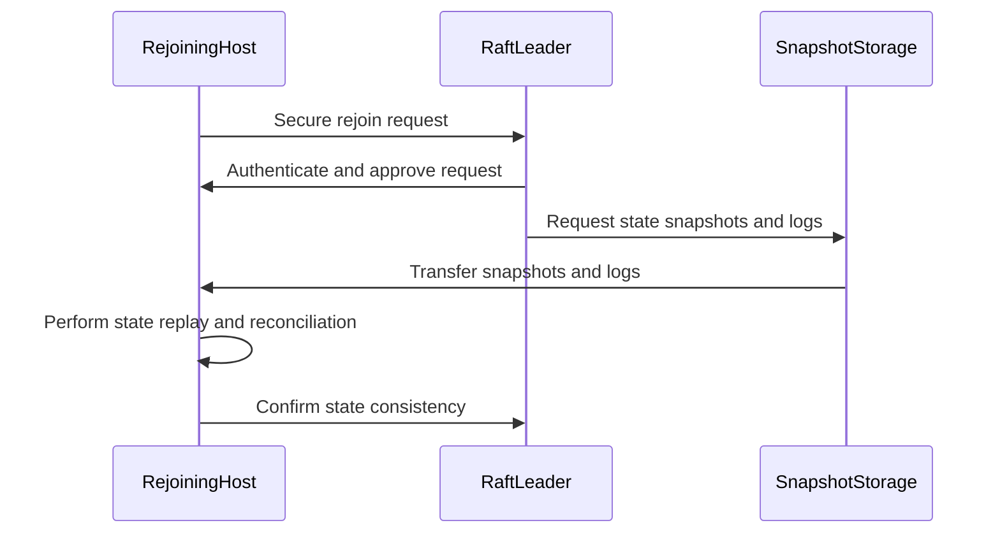

## Host Rejoining and State Reconciliation

### Gap Definition and Improvement Objectives

Flintlock currently lacks comprehensive procedures for rejoining hosts and effectively reconciling state upon reintegration. Introducing explicit host rejoining protocols and robust state reconciliation will ensure consistency and cluster stability.

**Objectives:**

* Secure and efficient host reintegration into the cluster
* Accurate reconciliation of host and cluster states
* Consistent cluster state verification post-rejoin

### Technical Implementation and Detailed Architecture

* **Host Rejoin Protocol:** Define explicit procedures for secure and authenticated host rejoin requests.
* **State Replay:** Implement incremental Raft log replay and snapshot synchronisation upon host reintegration.
* **Consistency Verification:** Establish detailed state consistency verification protocols post-reintegration.
* **Secure Handshake:** Enforce secure handshakes and validation during the rejoin process.

### Trade-offs and Risks

* **Complexity:** Increased operational complexity due to detailed state reconciliation protocols.
* **Resource Overhead:** Potential overhead during state synchronisation and verification.

### Operational Impacts and User Considerations

* **Operational Simplicity:** Reduced manual intervention required for host reintegration.
* **Enhanced Reliability:** Ensures reliable and consistent cluster states after host rejoining.

### Validation and Testing Strategies

* **Rejoin Protocol Tests:** Validate secure and reliable host rejoin procedures.
* **State Synchronisation Tests:** Verify accurate synchronisation and reconciliation of host states.
* **Consistency Checks:** Systematic checks of state consistency post-reintegration.

### Visualisations and Diagrams

* **High-Level Design (HLD) Diagram:**

* **Sequence Diagram:**

### Summary for Enhancement Proposal

Implementing explicit host rejoining protocols and robust state reconciliation significantly enhances Flintlock’s operational reliability and cluster state consistency. This structured approach ensures secure reintegration, accurate state synchronisation, and reduced operational complexity, greatly improving cluster stability and management efficiency.
