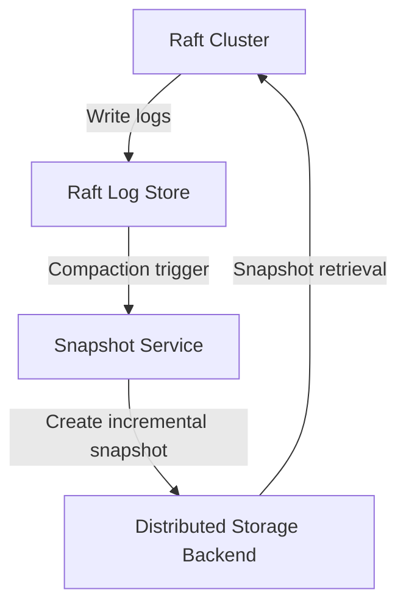
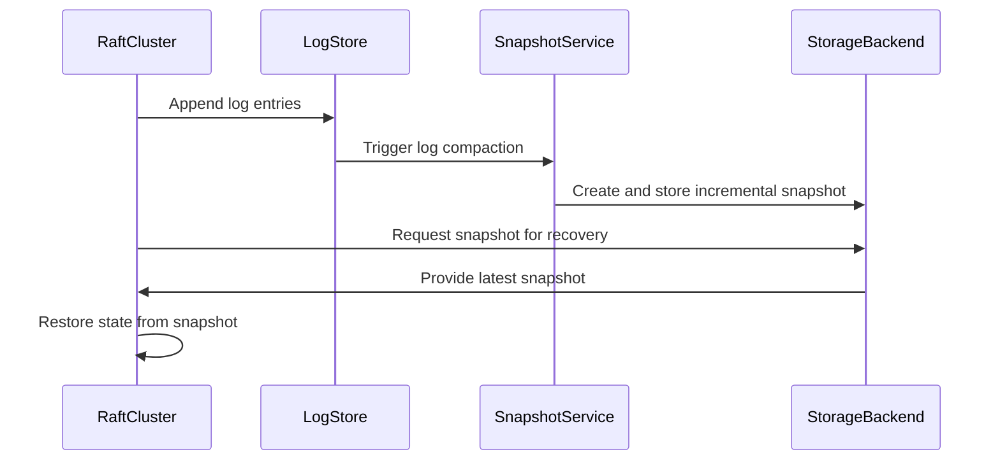

## Raft Log Scalability and Snapshotting

### Gap Definition and Improvement Objectives

Flintlock's current Raft implementation lacks adequate log compaction and snapshot management, risking performance degradation over time. Implementing scalable log management and efficient snapshotting mechanisms addresses this, ensuring sustained performance.

**Objectives:**

* Prevent excessive growth of Raft logs
* Efficiently compact logs to optimise storage
* Implement rapid and reliable snapshot creation and recovery

### Technical Implementation and Detailed Architecture

* **Log Compaction Policy:** Define explicit policies and intervals for Raft log compaction.
* **Snapshot Frequency:** Establish optimal snapshot frequencies that balance storage usage and recovery performance.
* **Incremental Snapshotting:** Implement incremental snapshot methods for efficiency.
* **Snapshot Storage:** Utilise robust and distributed storage solutions to ensure high availability and rapid recovery.

### Trade-offs and Risks

* **Resource Overhead:** Incremental snapshotting and frequent compactions add operational overhead.
* **Complexity:** Increased complexity in managing incremental snapshots and compaction processes.

### Operational Impacts and User Considerations

* **Performance Maintenance:** Prevents performance degradation over extended operation periods.
* **Reduced Recovery Time:** Quick snapshot recovery enhances cluster resilience and minimises downtime.

### Validation and Testing Strategies

* **Compaction Performance Tests:** Evaluate the efficiency and performance impact of log compaction.
* **Snapshot Accuracy Tests:** Verify snapshot accuracy and completeness post-compaction.
* **Recovery Benchmarks:** Benchmark snapshot recovery speed and reliability.

### Visualisations and Diagrams

* **High-Level Design (HLD) Diagram:**

* **Sequence Diagram:**

### Summary for Enhancement Proposal

Implementing scalable Raft log compaction and efficient snapshotting significantly enhances Flintlock's long-term operational performance and resilience. This structured approach ensures optimal storage usage, rapid recovery capabilities, and sustained cluster efficiency, addressing critical operational and performance gaps.
