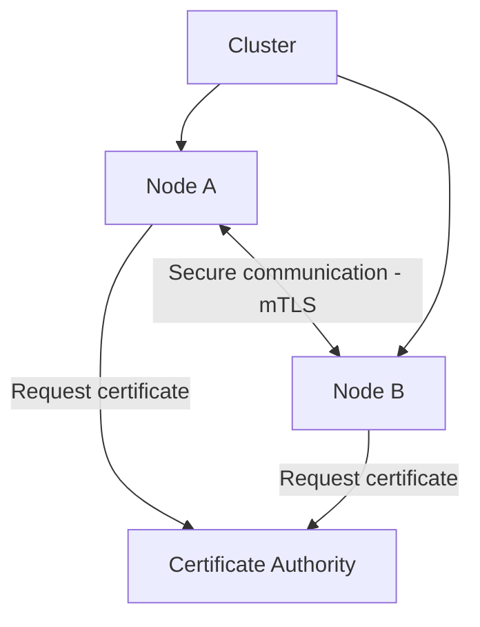
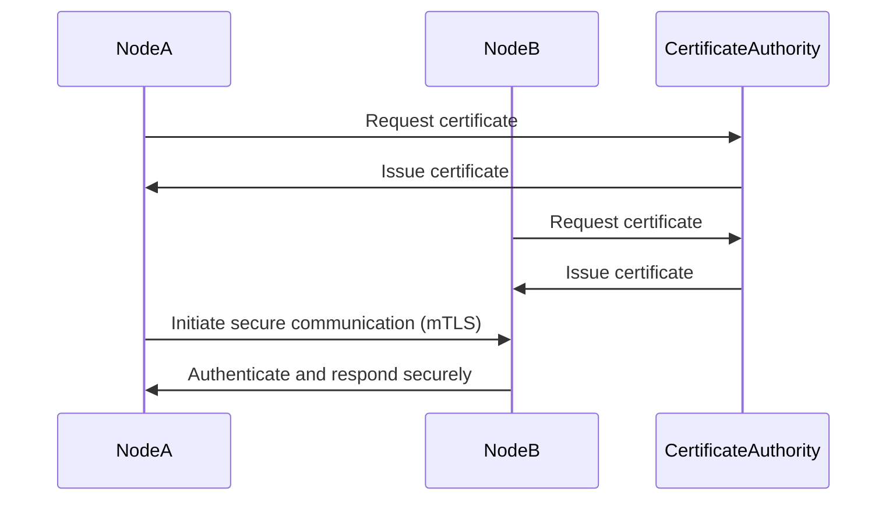

## Security and Authorization

### Gap Definition and Improvement Objectives

Flintlock currently lacks comprehensive intra-cluster security, authentication, and authorization mechanisms, posing potential security risks. Introducing explicit security and authorization protocols will significantly improve cluster protection and operational safety.

**Objectives:**

* Secure intra-cluster communication using mutual TLS (mTLS)
* Robust authentication mechanisms for cluster nodes
* Comprehensive authorization models for API access control

### Technical Implementation and Detailed Architecture

* **Mutual TLS (mTLS):** Implement mTLS for encrypted and authenticated intra-cluster communication.
* **Authentication Protocols:** Define clear and secure authentication protocols for node interactions and joining processes.
* **Authorization Controls:** Establish robust role-based access control (RBAC) for API endpoints.
* **Credential Management:** Centralize secure credential storage and management.

### Trade-offs and Risks

* **Complexity:** Increased complexity managing certificates and credentials.
* **Performance Impact:** Minor overhead from encryption and authentication processes.

### Operational Impacts and User Considerations

* **Enhanced Security Posture:** Significantly reduces risk exposure and improves overall cluster security.
* **Operational Management:** Simplifies operational security management through clear protocols and centralized credential management.

### Validation and Testing Strategies

* **Security Protocol Tests:** Regular validation of mTLS implementation and credential management.
* **Authorization Enforcement Tests:** Systematic verification of RBAC effectiveness.
* **Performance Benchmarks:** Assess performance impacts due to security protocols.

### Visualizations and Diagrams

* **High-Level Design (HLD) Diagram:**

* **Sequence Diagram:**

### Summary for Enhancement Proposal

Introducing comprehensive intra-cluster security, authentication, and authorization mechanisms significantly enhances Flintlock's security posture. By utilizing mutual TLS, robust authentication, and precise authorization controls, the cluster achieves heightened protection, operational clarity, and simplified security management.
