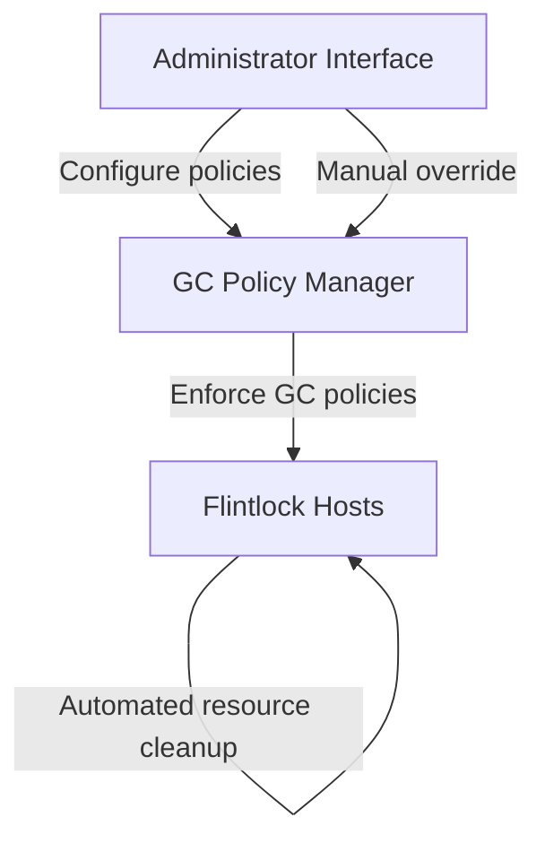
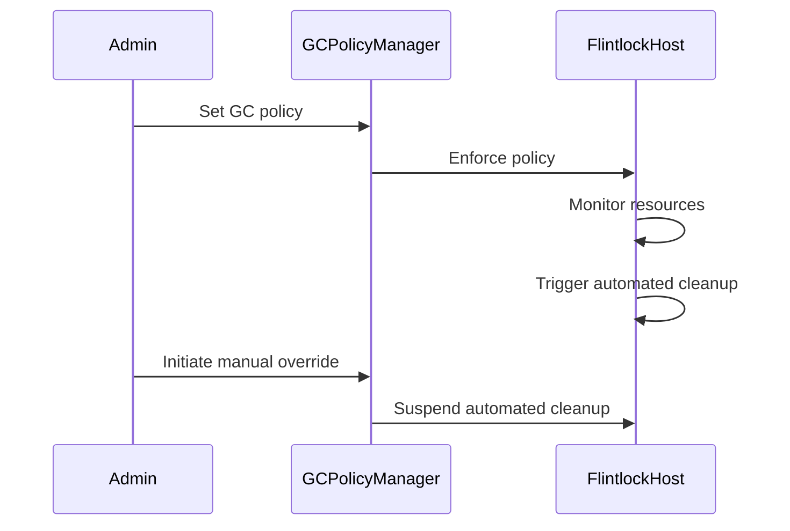

## Garbage Collection Policy

### Gap Definition and Improvement Objectives

Flintlock currently lacks explicit and configurable garbage collection (GC) policies, leading to potential resource leaks and unintended service disruptions. Implementing robust GC policies ensures safe and controlled cleanup of resources.

**Objectives:**

* Define explicit GC triggers and cleanup procedures
* Allow configurable GC timeouts and grace periods
* Provide mechanisms for manual overrides to ensure operational safety

### Technical Implementation and Detailed Architecture

* **Configurable GC Policies:** Allow administrators to configure GC triggers, timeout values, and grace periods.
* **Automated Cleanup:** Implement automated cleanup of VM and host resources based on configured policies.
* **Manual Overrides:** Provide administrators with mechanisms to manually override automated GC processes.
* **Safe Termination Procedures:** Define safe and controlled methods for terminating resources.

### Trade-offs and Risks

* **Premature Cleanup Risk:** Potential premature resource termination if timeouts are misconfigured.
* **Complexity in Policy Management:** Additional complexity in managing configurable policies and manual overrides.

### Operational Impacts and User Considerations

* **Reduced Resource Leakage:** Significant reduction in resource leakage through automated cleanup.
* **Operational Safety:** Enhanced operational safety through configurable policies and manual intervention options.

### Validation and Testing Strategies

* **Automated Cleanup Tests:** Systematic verification of automated cleanup processes.
* **Policy Enforcement Tests:** Validate the accuracy and reliability of configured GC policies.
* **Override Mechanism Tests:** Ensure practical functionality of manual override mechanisms.

### Visualisations and Diagrams

* **High-Level Design (HLD) Diagram:**

* **Sequence Diagram:**

### Summary for Enhancement Proposal

Implementing explicit and configurable garbage collection policies significantly enhances Flintlock's resource management, operational safety, and overall reliability. This structured approach provides automated, safe resource cleanup, configurable policies, and effective manual intervention mechanisms, addressing critical operational gaps.
