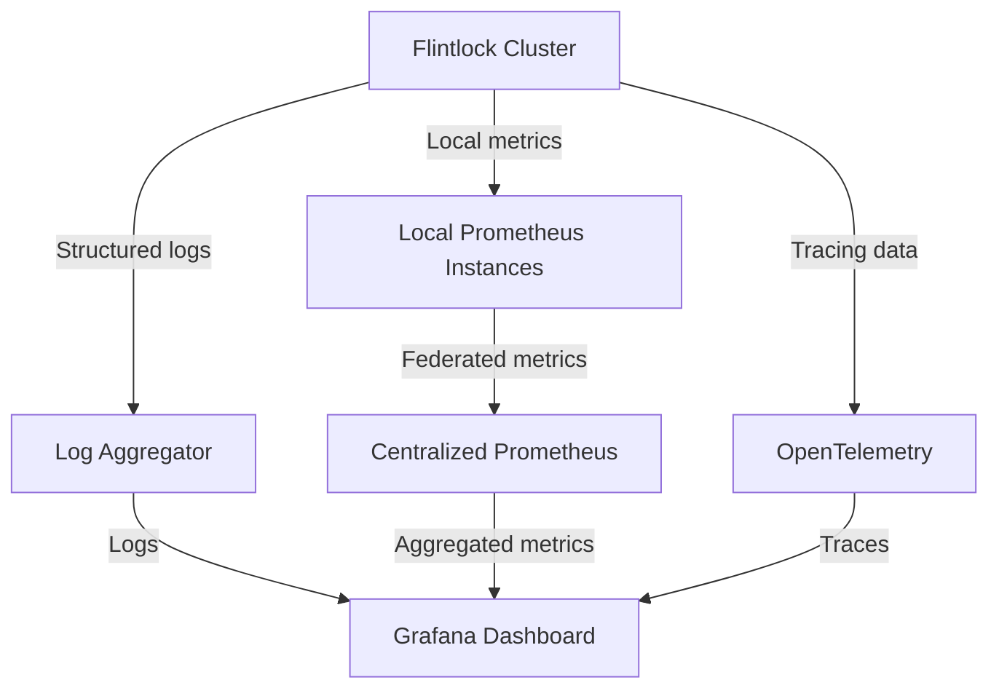
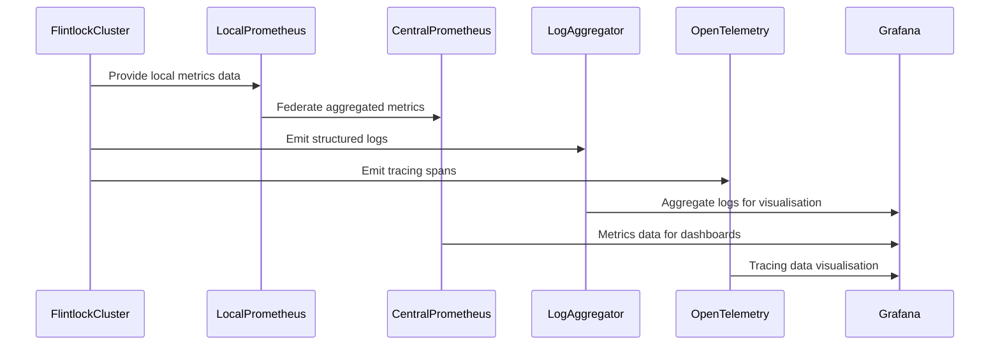

## Observability, Metrics, and Tracing

### Gap Definition and Improvement Objectives

Flintlock currently lacks comprehensive observability tools, which limits its effective monitoring, debugging, and performance analysis capabilities. Introducing structured logging, metrics collection, and distributed tracing will address these limitations.

**Objectives:**

* Enhance visibility into cluster operations and VM lifecycle
* Facilitate efficient debugging, monitoring, and incident resolution
* Integrate industry-standard observability tools for operational transparency

### Technical Implementation and Detailed Architecture

* **Structured Logging:** Implement structured log aggregation with centralised log management.
* **Metrics Collection:** Integrate Prometheus for metrics collection, capturing critical system performance indicators.
* **Centralised Metrics Aggregation:** Implement a consolidated Prometheus instance to aggregate metrics from all hosts, enabling holistic monitoring.
* **Local Metrics Endpoints:** Maintain local Prometheus endpoints on each host to facilitate local debugging and inspection.
* **Distributed Tracing:** Utilise OpenTelemetry to implement distributed tracing for detailed operation insights.
* **Visualisation Dashboards:** Develop Grafana dashboards for visualising metrics and tracing data.

### Trade-offs and Risks

* **Overhead:** Minor performance overhead from detailed metrics collection and tracing.
* **Complexity:** Increased complexity in maintaining integrated observability systems.

### Operational Impacts and User Considerations

* **Enhanced Transparency:** Significantly improved system transparency and visibility.
* **Operational Efficiency:** Faster identification and resolution of operational issues.

### Validation and Testing Strategies

* **Logging Verification:** Regular validation of structured log accuracy and completeness.
* **Metrics Accuracy Tests:** Ensure the correctness of metrics collection and the accuracy of visualisation.
* **Tracing Validation:** Systematic tests of tracing integration and reliability.
* **Aggregation Verification:** Confirm the accurate aggregation of metrics in the central Prometheus instance.

### Visualisations and Diagrams

* **High-Level Design (HLD) Diagram:**

* **Sequence Diagram:**

### Summary for Enhancement Proposal

Introducing comprehensive observability tools, centralised metrics aggregation, and distributed tracing significantly enhances Flintlock’s operational visibility and debugging capabilities. This structured approach enables effective monitoring, rapid incident response, and improved cluster performance management, addressing critical gaps in operational transparency.
