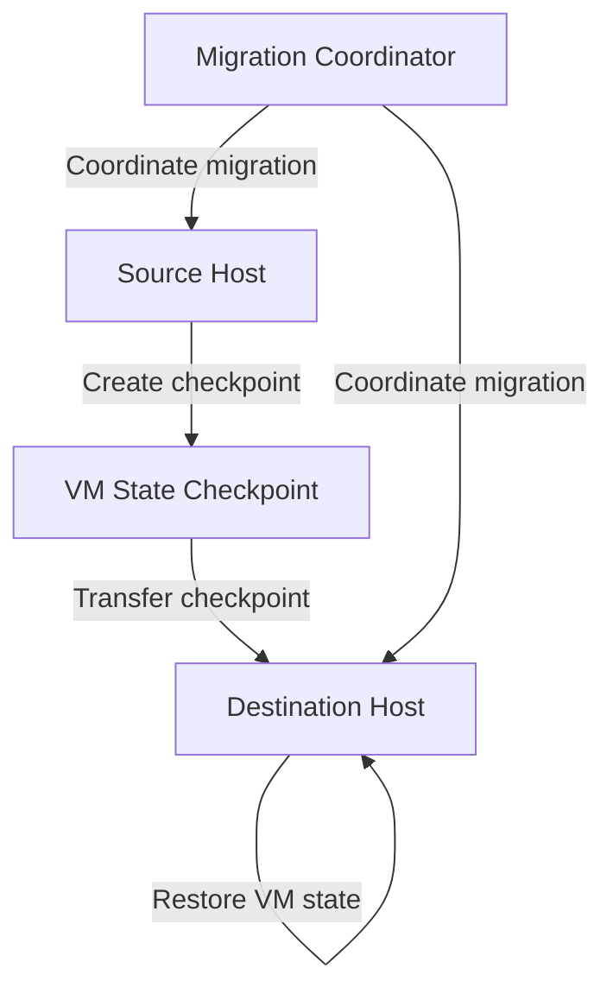
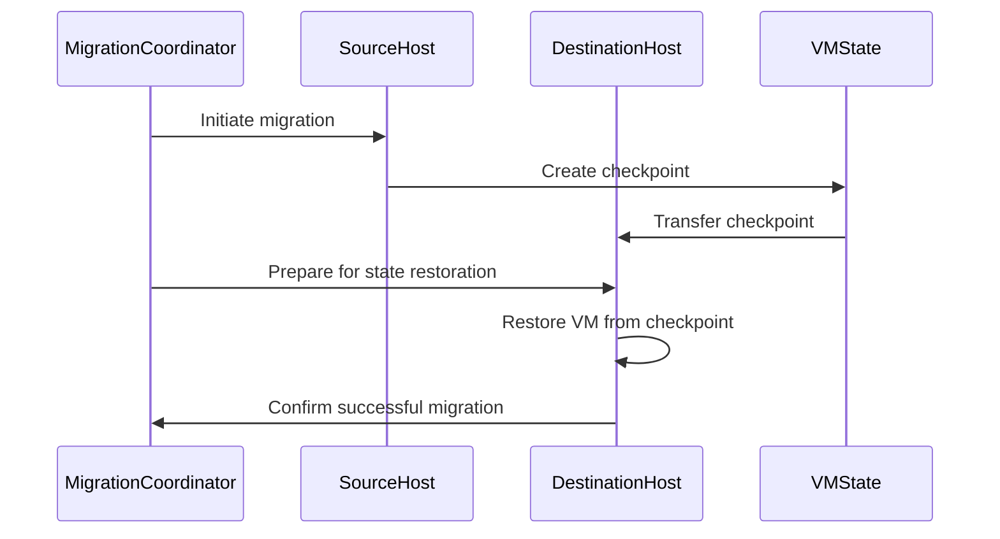

## Graceful VM Migration Support

### Gap Definition and Improvement Objectives

Currently, Flintlock lacks explicit support for seamless VM migration, which limits flexibility and service continuity during host maintenance or failures. Introducing VM migration capabilities will significantly reduce downtime and improve service resilience.

**Objectives:**

* Smooth and efficient migration of VMs across hosts
* Minimised downtime during migration processes
* Effective state checkpointing and transfer

### Technical Implementation and Detailed Architecture

* **Live Migration Feasibility:** Conduct a detailed feasibility analysis for live migration.
* **Checkpointing Techniques:** Develop methods for capturing consistent VM states.
* **State Transfer Protocol:** Define reliable protocols for transferring VM state data across hosts.
* **Migration Coordination:** Implement migration coordination logic to handle concurrent migrations and conflict resolution.

### Trade-offs and Risks

* **Complexity:** Significant complexity in implementing and maintaining live migration capabilities.
* **Performance Impact:** Potential performance overhead during migration events.

### Operational Impacts and User Considerations

* **Downtime Reduction:** A significant decrease in VM downtime, enhancing the user experience.
* **Operational Flexibility:** Increased flexibility in cluster management, especially during maintenance windows or unexpected failures.

### Validation and Testing Strategies

* **Reliability Tests:** Ensure reliability and consistency of VM state post-migration.
* **Performance Benchmarks:** Evaluate performance overhead and optimise the migration process.
* **Checkpointing Accuracy:** Rigorous testing of checkpoint accuracy and consistency.

### Visualisations and Diagrams

* **High-Level Design (HLD) Diagram:**

* **Sequence Diagram:**

### Summary for Enhancement Proposal

Introducing graceful VM migration to Flintlock addresses critical service continuity gaps, significantly reducing downtime and enhancing operational flexibility. By carefully balancing complexity and performance, this improvement ensures robust service delivery and operational agility.
